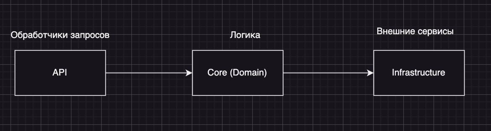

# Ресторан "Головоломка"

##  Идз №3 по Кпо
### Выполнил: студент группы БПИ-218 Гречко Андрей

### Почему "Головоломка"?
В этом вся головоломка.

### Архитектура микросервисов


Вполне чистая архитектура.

- API содержит описание запросов, логику их валидации и контроля доступа.
- Core содержит бизнес-логику, описание моделей, сущностей бд, интерфейсы сервисов и репозиториев.
- Infrastructure содержит реализации репозиториев.

### Запуск решения

1. Поднять контейнеры с бд
```bash
docker compose up -d oms-auth-db oms-db
```
2. Поднять контейнеры с микросервисами
```bash
docker compose up -d oms-auth oms
```
3. Открыть swagger сервиса аутентификации: http://localhost:5030/swagger/index.html
4. Открыть swagger сервиса заказов: http://localhost:5031/swagger/index.html
